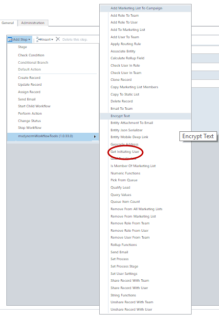
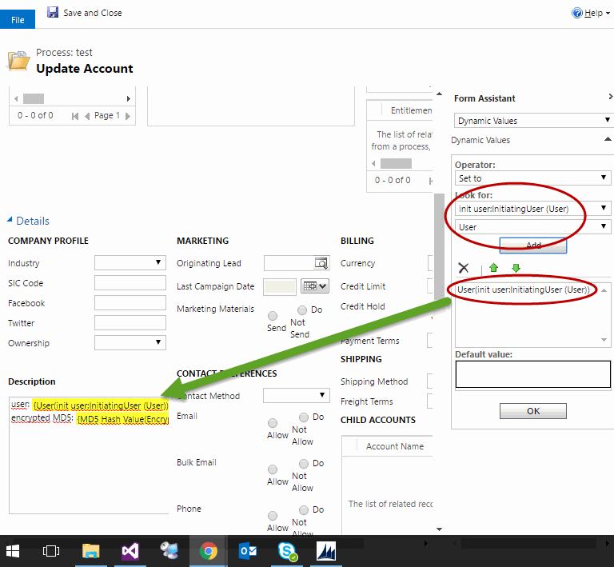

# Get Initiating User (دریافت کاربر شروع‌کننده)

این استپ کاربری را برمی‌گرداند که اجرای Workflow را در ابتدا شروع کرده است.

این کاربر لزوماً مالک (Owner) Workflow نیست: Workflowهای پس‌زمینه (background) با مالک Workflow اجرا می‌شوند، ولی این استپ کاربری را برمی‌گرداند که کارش باعث شروع Workflow شده است.

برای استفاده از این استپ، در طراحی Workflow از منوی **Add Step** به گروه **MvcTeam Security** بروید و **Get Initiating User** را انتخاب کنید:

این استپ پارامتر ورودی ندارد و فقط یک پارامتر خروجی دارد:

* **Initiating User** : یک Lookup به کاربر (user) شروع‌کننده‌ی Workflow.

می‌توانید آن را در استپ‌های بعدی مثل مثال زیر استفاده کنید:

> **توجه:** تصاویر بالا از پروژه‌ی اصلی گرفته شده‌اند و رابط کاربری CRM در آن‌ها انگلیسی است.

---

منبع: این مستند ترجمه و بازنویسی مستند استپ Get Initiating User از پروژه‌ی متن‌باز [Dynamics-365-Workflow-Tools](https://github.com/demianrasko/Dynamics-365-Workflow-Tools) (نوشته‌ی Demian Rasko، مجوز Ms-PL) است.

