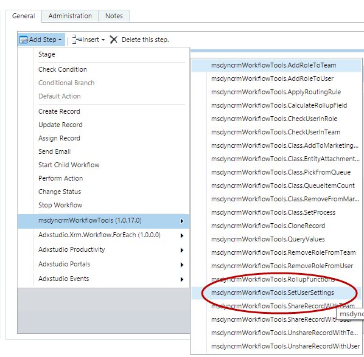
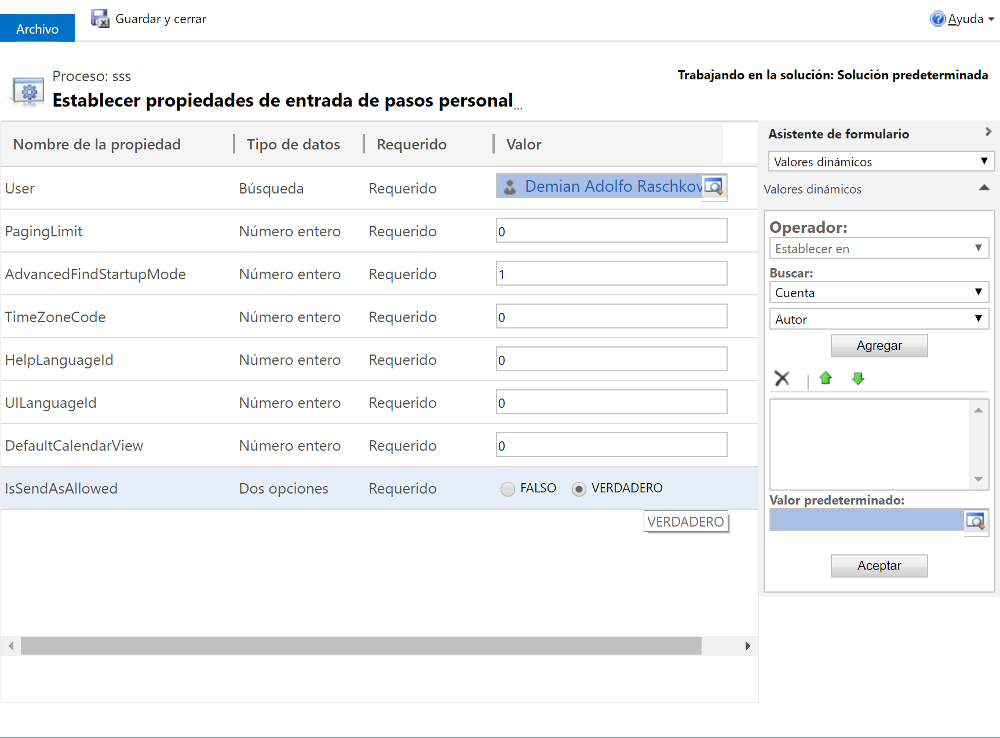

<!-- nav-top -->
[« صفحه‌ی اصلی](../../README.md) › [امنیت و دسترسی](../../README.md#security)

# تغییر تنظیمات کاربر در Dynamics CRM (استپ Set User Settings)

این استپ به شما اجازه می‌دهد تنظیمات شخصی یک کاربر را تغییر دهید: تعداد رکورد در هر صفحه، حالت Advanced Find، منطقه‌ی زمانی، زبان راهنما و رابط کاربری، نمای پیش‌فرض تقویم و اجازه‌ی Send As.

برای استفاده از این استپ، در طراحی Workflow از منوی **Add Step** به گروه **MvcTeam Security** بروید و **Set User Settings** را انتخاب کنید:

سپس پارامترها را پر کنید:

## شرح کامل پارامترها

* **User (اجباری)** : کاربری که تنظیماتش تغییر می‌کند.
* **Paging Limit** : تعداد رکورد در هر صفحه‌ی نمایش (view). مقدارهای مجاز: `25`، `50`، `75`، `100`، `250`. مقدار `0` یعنی بدون تغییر.
* **Advanced Find Startup Mode** : حالت شروع Advanced Find. `1` یعنی ساده (simple) و `2` یعنی تفصیلی (detail). هر مقدار دیگر (مثلاً `0`) یعنی بدون تغییر.
* **Time Zone Code** : کد منطقه‌ی زمانی کاربر. برای دیدن همه‌ی کدها از دستور `Get-CrmTimeZones` استفاده کنید. مقدار `0` یعنی بدون تغییر.
* **Help Language Id** : شناسه‌ی یکتای زبان راهنما (LCID، مثلاً `1033` برای انگلیسی). مقدار `0` یعنی بدون تغییر.
* **UI Language Id** : شناسه‌ی یکتای زبانی که رابط کاربری با آن نمایش داده می‌شود (LCID). مقدار `0` یعنی بدون تغییر.
* **Default Calendar View (پیش‌فرض: `-1`)** : نمای پیش‌فرض تقویم. `0` یعنی روز، `1` یعنی هفته و `2` یعنی ماه. مقدار `-1` یعنی بدون تغییر.
* **Is Send As Allowed** : اجازه‌ی ارسال ایمیل به نام کاربر (`True` یا `False`). این مقدار فقط وقتی اعمال می‌شود که **Update Send As** برابر `True` باشد.
* **Update Send As (اجباری، پیش‌فرض: False)** : اگر `True` باشد، مقدار Is Send As Allowed روی کاربر اعمال می‌شود. اگر `False` باشد، Send As کاربر دست نمی‌خورد.

این استپ پارامتر خروجی ندارد.

## نکته‌ها

* برای Paging Limit و Time Zone Code و Help Language Id و UI Language Id مقدار `0` یعنی آن تنظیم دست نمی‌خورد. برای Advanced Find Startup Mode هم هر مقداری غیر از `1` و `2` یعنی بدون تغییر.
* Default Calendar View و Send As فقط وقتی تغییر می‌کنند که خودتان بخواهید: نمای تقویم فقط با مقدار `0` یا `1` یا `2` تغییر می‌کند (پیش‌فرض `-1` یعنی بدون تغییر)، و Send As فقط وقتی Update Send As برابر `True` باشد. با مقدارهای پیش‌فرض، هیچ‌کدام از این دو دست نمی‌خورند.
* پیش‌فرض Advanced Find Startup Mode برابر `1` است؛ اگر نمی‌خواهید حالت Advanced Find کاربر عوض شود، مقدار `0` بدهید.
* استپ با دسترسی کاربر اجراکننده‌ی Workflow اجرا می‌شود؛ پس آن کاربر باید اجازه‌ی خواندن و تغییر تنظیمات کاربر موردنظر را داشته باشد (مثلاً مدیر سیستم). به همین دلیل کاربر عادی نمی‌تواند با این استپ به کاربر دیگری اجازه‌ی Send As بدهد.

> **توجه:** تصویر بالا از پروژه‌ی اصلی گرفته شده است. رابط کاربری CRM در آن اسپانیایی است و نام پارامترها به‌صورت بدون فاصله دیده می‌شود (مثلاً `PagingLimit`)، در حالی که نام آن‌ها در این استپ با فاصله است (مثلاً `Paging Limit`).

---

منبع: این مستند ترجمه و بازنویسی مستند استپ Set User Settings از پروژه‌ی متن‌باز [Dynamics-365-Workflow-Tools](https://github.com/demianrasko/Dynamics-365-Workflow-Tools) (نوشته‌ی Demian Rasko، مجوز Ms-PL) است.

---

<!-- nav-bottom -->
[⬆ بازگشت به فهرست اصلی و همه‌ی استپ‌ها](../../README.md#steps)

