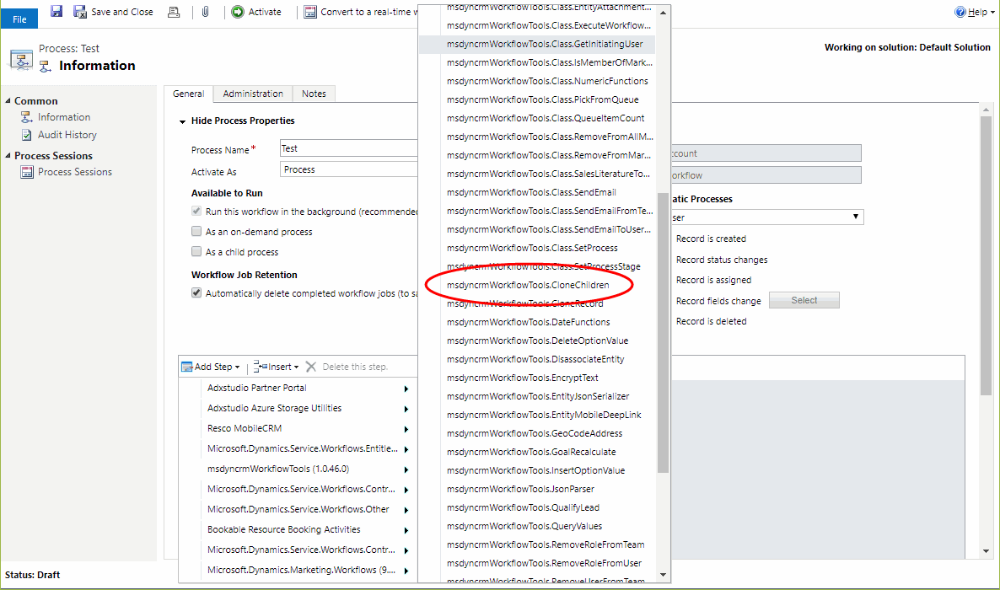

<!-- nav-top -->
[« صفحه‌ی اصلی](../../README.md) › [ابزارهای عمومی](../../README.md#utilities)

# کلون کردن رکوردهای فرزند در Dynamics CRM (استپ Clone Children)

این استپ برای کلون کردن رکوردهای فرزند (Child) یک رکورد بسیار کاربردی است. آدرس (URL) رکورد مبدأ، آدرس رکورد مقصد و نام رابطه (Relationship) را به آن می‌دهید؛ استپ همه‌ی رکوردهای فرزند رکورد مبدأ را کپی می‌کند و کپی‌ها را به رکورد والد (Parent) جدید متصل می‌کند.

برای استفاده از این استپ، در طراحی Workflow از منوی **Add Step** به گروه **MvcTeam Utilities** بروید و **Clone Children** را انتخاب کنید:

سپس پارامترهای رکورد مبدأ و مقصد و گزینه‌های کلون رکوردهای فرزند را مشخص کنید.

## شرح کامل پارامترها

* **Source Record URL (اجباری)** : آدرس رکورد والدی که رکوردهای فرزندِ موردنظر برای کلون در آن قرار دارند.
* **Target Record URL (اجباری)** : آدرس رکورد والدی که رکوردهای فرزندِ کلون‌شده به آن متصل می‌شوند.
* **Relationship Name (اجباری)** : نام اسکیما (schema name) رابطه‌ی یک‌به‌چند (one-to-many) که برای پیدا کردن رکوردهای فرزند استفاده می‌شود.
* **New Parent Field Name (اجباری)** : نام منطقی (logical name) فیلد Lookup روی رکوردهای فرزند که باید به والد جدید (Target) اشاره کند.
* **Old Parent Field Name (اختیاری)** : نام منطقی فیلد Lookup روی رکوردهای فرزند که به والد اصلی (Source) اشاره می‌کرد. اگر این پارامتر را پر کنید و با New Parent Field Name فرق داشته باشد، مقدار این فیلد در کپی‌ها خالی می‌شود تا کپی‌ها به والد اصلی وصل نمانند. اگر خالی بماند یا با New Parent Field Name یکی باشد، فیلد دیگری خالی نمی‌شود.
* **Prefix (اختیاری)** : پیشوندی که به ابتدای فیلد نام اصلی (Primary Name) هر رکورد کلون‌شده اضافه می‌شود.
* **Fields to Ignore (اختیاری)** : فهرست فیلدهایی که نمی‌خواهید در کپی‌ها کپی شوند. نام منطقی (logical name) فیلدها را وارد کنید و با «;» یا «,» از هم جدا کنید.

این استپ پارامتر خروجی ندارد.

## نکته‌ها

* اگر رابطه‌ای که در Relationship Name وارد می‌کنید از نوع یک‌به‌چند نباشد، استپ با خطا متوقف می‌شود.
* استپ با دسترسی کاربر اجراکننده‌ی Workflow اجرا می‌شود؛ پس هر کاربر فقط چیزی را می‌تواند کلون کند که خودش اجازه‌ی ساختنش را دارد.

> **نکته:** Record URL یک قابلیت استاندارد Dynamics CRM است و آدرس کامل یک رکورد را در خود دارد. در این آدرس نوع موجودیت (entity type) و GUID رکورد وجود دارد. در حال حاضر این تنها راهی است که برای ارسال یک EntityReference «داینامیک» (بدون ثابت‌نویسی نوع موجودیت) به Workflow Activity ها داریم. اگر این آدرس را به‌صورت رشته به‌عنوان پارامتر بدهید، استپ می‌تواند از روی آن EntityReference را بازیابی کند.

> **توجه:** تصویر بالا از پروژه‌ی اصلی گرفته شده و رابط کاربری CRM در آن انگلیسی است.

---

منبع: این مستند ترجمه و بازنویسی مستند استپ Clone Children از پروژه‌ی متن‌باز [Dynamics-365-Workflow-Tools](https://github.com/demianrasko/Dynamics-365-Workflow-Tools) (نوشته‌ی Demian Rasko، مجوز Ms-PL) است.

---

<!-- nav-bottom -->
[⬆ بازگشت به فهرست اصلی و همه‌ی استپ‌ها](../../README.md#steps)

