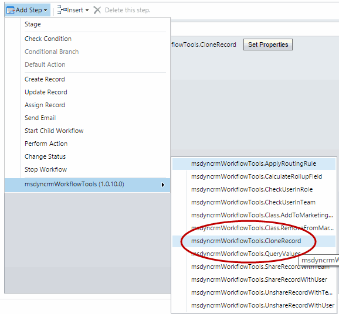
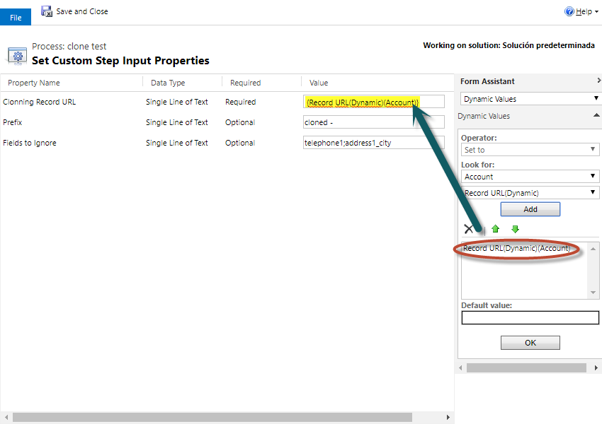
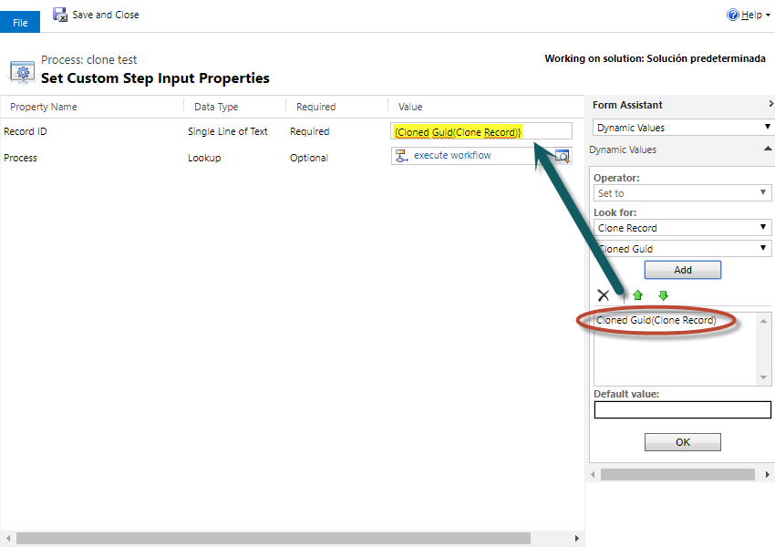

# Clone Record (کلون کردن رکورد)

این استپ برای ساخت یک کپی از یک رکورد بسیار کاربردی است. آدرس (URL) یک رکورد را به آن می‌دهید و یک رکورد جدید با همان مقادیر ایجاد می‌کند.

برای استفاده از این استپ، در طراحی Workflow از منوی **Add Step** به گروه **MvcTeam Utilities** بروید و **Clone Record** را انتخاب کنید:

سپس فیلد **Record URL (Dynamic)** مربوط به موجودیتی که می‌خواهید کلون شود را به‌عنوان آدرس رکورد انتخاب کنید:

## شرح کامل پارامترها

* **Cloning Record URL (اجباری)** : آدرس رکوردی که می‌خواهید کلون شود.
* **Prefix (اختیاری)** : پیشوندی که به ابتدای فیلد نام اصلی (Primary Name) رکورد کلون‌شده اضافه می‌شود.
* **Fields to Ignore (اختیاری)** : فهرست فیلدهایی که نمی‌خواهید در رکورد جدید کپی شوند. نام منطقی (logical name) فیلدها را وارد کنید و با «;» یا «,» از هم جدا کنید.
* **پارامتر خروجی: Cloned Guid** : رشته‌ای حاوی GUID رکورد جدید. می‌توانید مانند تصویر زیر از آن در استپ‌های بعدی استفاده کنید:

> **نکته:** Parent Record URL یک قابلیت استاندارد Dynamics CRM است و آدرس کامل یک رکورد را در خود دارد. در این آدرس نوع موجودیت (entity type) و GUID رکورد وجود دارد. در حال حاضر این تنها راهی است که برای ارسال یک EntityReference «داینامیک» (بدون ثابت‌نویسی نوع موجودیت) به Workflow Activity ها داریم. اگر این آدرس را به‌صورت رشته به‌عنوان پارامتر بدهید، استپ می‌تواند از روی آن EntityReference را بازیابی کند.

> **توجه:** تصاویر بالا از پروژه‌ی اصلی گرفته شده‌اند و رابط کاربری CRM در آن‌ها انگلیسی است. در تصویر اول نام پارامتر با غلط املایی «Clonning Record URL» دیده می‌شود، در حالی که نام درست آن در این استپ «Cloning Record URL» است.

---

منبع: این مستند ترجمه و بازنویسی مستند استپ Clone Record از پروژه‌ی متن‌باز [Dynamics-365-Workflow-Tools](https://github.com/demianrasko/Dynamics-365-Workflow-Tools) (نوشته‌ی Demian Rasko، مجوز Ms-PL) است.

