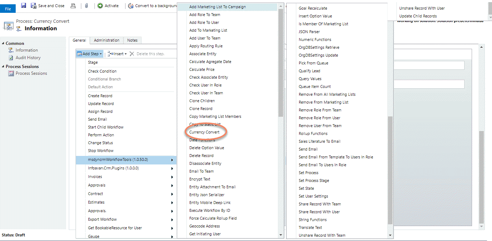
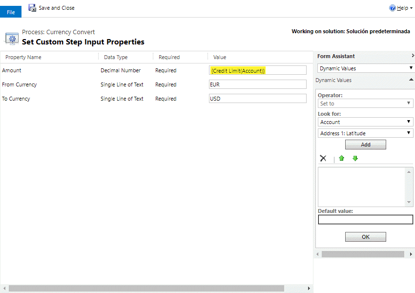
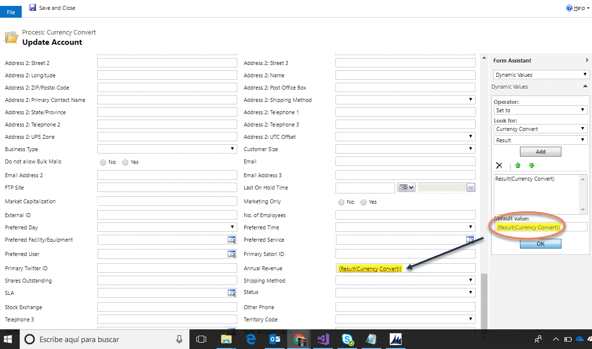

# Currency Convert (تبدیل ارز)

این استپ یک مبلغ را از یک ارز به ارز دیگر تبدیل می‌کند. نرخ‌های تبدیل از ارزهایی گرفته می‌شود که خود CRM نگهداری می‌کند (**Settings > Business Management > Currencies**)، بنابراین به اینترنت نیازی ندارد.

> **توجه:** نسخه‌ی اصلی این استپ در پروژه‌ی متن‌باز از سرویس آنلاین Google برای نرخ‌ها استفاده می‌کرد که دیگر وجود ندارد. در این پروژه استپ بازنویسی شده است و نرخ‌ها را از CRM می‌خواند.

برای استفاده از این استپ، در طراحی Workflow از منوی **Add Step** به گروه **MvcTeam Utilities** بروید و **Currency Convert** را انتخاب کنید:

سپس پارامترها را پر کنید:

در نهایت می‌توانید نتیجه را در استپ‌های بعدی Workflow استفاده کنید:

## شرح کامل پارامترها

* **Amount (اجباری)** : مبلغی که می‌خواهید تبدیل شود (عدد اعشاری).
* **From Currency (اجباری)** : کد ISO ارز مبدأ، مثلاً `IRR` یا `USD` یا `EUR`.
* **To Currency (اجباری)** : کد ISO ارز مقصد.
* **پارامتر خروجی: Result** : مبلغ تبدیل‌شده (عدد اعشاری).

## روش محاسبه

نرخ هر ارز در CRM یعنی چند واحد از آن ارز برابر با ۱ واحد از ارز پایه (Base Currency) است. استپ مبلغ را این‌طور محاسبه می‌کند:

`Result = Amount × نرخ ارز مقصد ÷ نرخ ارز مبدأ`

اگر ارز مبدأ و مقصد یکی باشند، همان مبلغ برگردانده می‌شود.

**مثال (با اعداد فرضی):** فرض کنید ارز پایه USD است (نرخ آن ۱) و نرخ EUR در CRM برابر `0.9` است. تبدیل `90` یورو به دلار می‌شود: ۹۰ × ۱ ÷ ۰٫۹ = **۱۰۰** دلار.

## نکته‌ها

* هر دو ارز باید در CRM به‌عنوان ارز **فعال (Active)** تعریف شده باشند و نرخ تبدیل آن‌ها بزرگ‌تر از صفر باشد. در غیر این صورت استپ با خطا متوقف می‌شود.
* نرخ‌ها را خودتان در CRM به‌روز نگه می‌دارید. استپ نرخ لحظه‌ای از اینترنت نمی‌گیرد.

> **توجه:** تصاویر بالا از پروژه‌ی اصلی گرفته شده‌اند و رابط کاربری CRM در آن‌ها انگلیسی است.

---

منبع: این مستند ترجمه و بازنویسی مستند استپ CurrencyConvert از پروژه‌ی متن‌باز [Dynamics-365-Workflow-Tools](https://github.com/demianrasko/Dynamics-365-Workflow-Tools) (نوشته‌ی Demian Rasko، مجوز Ms-PL) است.

