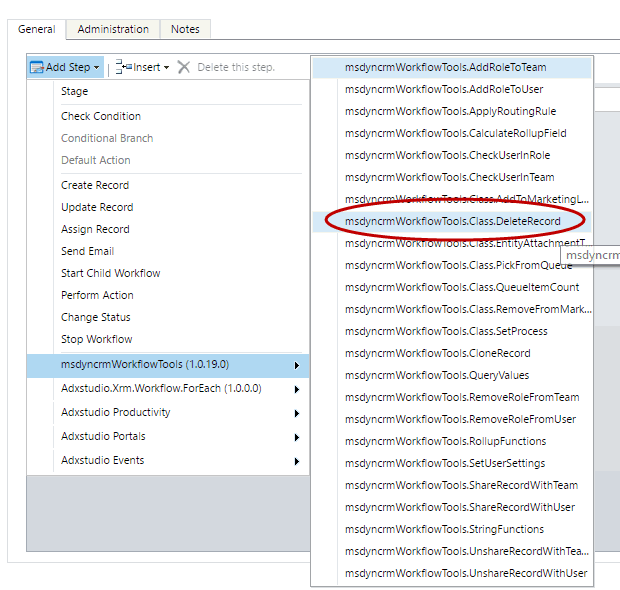
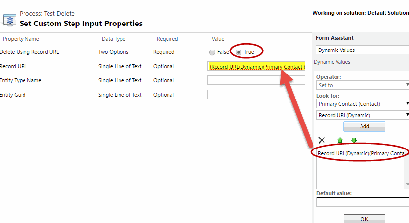
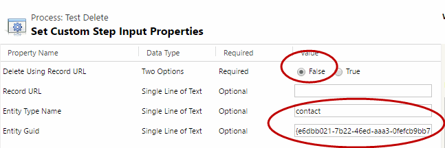

# Delete Record (حذف رکورد)

این استپ یک رکورد را حذف می‌کند. رکورد را می‌توان یا با آدرس (Record URL) یا با نوع موجودیت و GUID مشخص کرد.

> **هشدار:** حذف رکورد برگشت‌پذیر نیست. پیش از استفاده از این استپ در Workflow، مطمئن شوید شرایط اجرای آن درست تنظیم شده است.

برای استفاده از این استپ، در طراحی Workflow از منوی **Add Step** به گروه **MvcTeam Utilities** بروید و **Delete Record** را انتخاب کنید:

سپس اگر می‌خواهید رکورد را با آدرس (Record URL) حذف کنید، پارامترها را این‌طور پر کنید:

و اگر می‌خواهید رکورد را با GUID موجودیت حذف کنید:

## شرح کامل پارامترها

* **Delete Using Record URL (اجباری، پیش‌فرض: True)** : نحوه‌ی حذف را مشخص می‌کند. اگر `True` باشد، رکورد با Record URL حذف می‌شود؛ اگر `False` باشد، با Entity Type Name و Entity Guid.
* **Record URL** : آدرس رکوردی که باید حذف شود. اگر Delete Using Record URL برابر `True` باشد، پر کردن آن اجباری است.
* **Entity Type Name** : نام منطقی (logical name) موجودیتی که باید حذف شود، با حروف کوچک. اگر Delete Using Record URL برابر `False` باشد، پر کردن آن اجباری است.
* **Entity Guid** : GUID رکوردی که باید حذف شود. اگر Delete Using Record URL برابر `False` باشد، پر کردن آن اجباری است.

این استپ پارامتر خروجی ندارد.

## نکته‌ها

* اگر پارامتر لازم خالی باشد، استپ با خطا متوقف می‌شود و چیزی حذف نمی‌شود.
* استپ با دسترسی کاربر اجراکننده‌ی Workflow اجرا می‌شود؛ پس آن کاربر باید اجازه‌ی حذف (Delete) آن رکورد را داشته باشد.

> **توجه:** تصاویر بالا از پروژه‌ی اصلی گرفته شده‌اند و رابط کاربری CRM در آن‌ها انگلیسی است.

---

منبع: این مستند ترجمه و بازنویسی مستند استپ Delete Record از پروژه‌ی متن‌باز [Dynamics-365-Workflow-Tools](https://github.com/demianrasko/Dynamics-365-Workflow-Tools) (نوشته‌ی Demian Rasko، مجوز Ms-PL) است.

