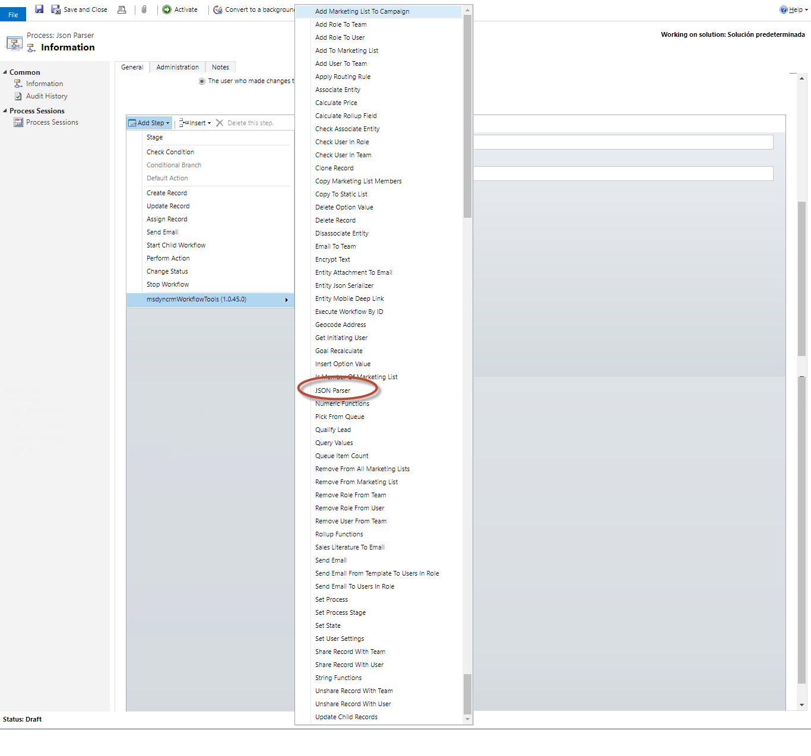
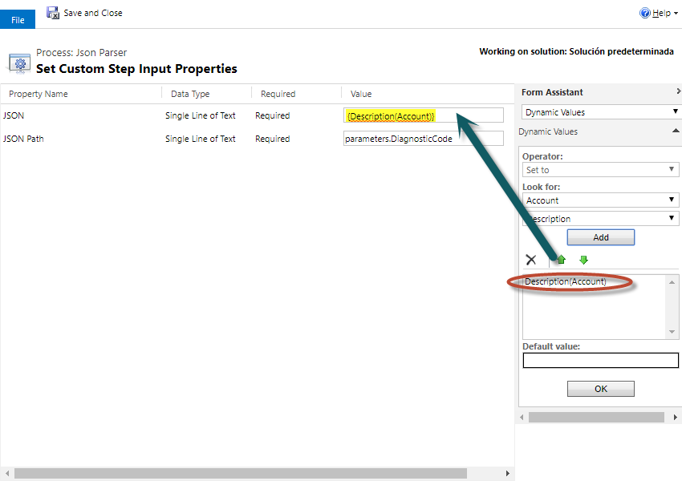
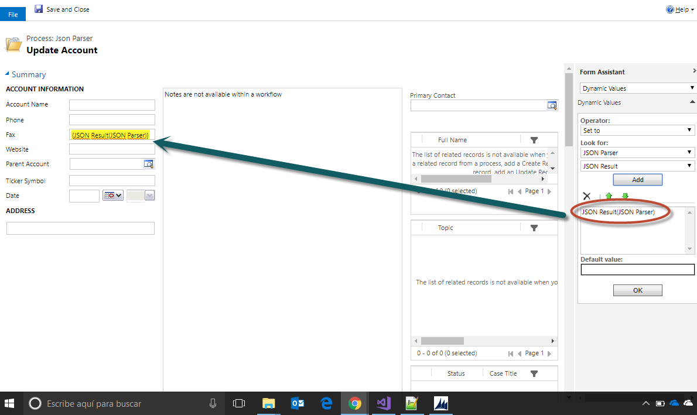
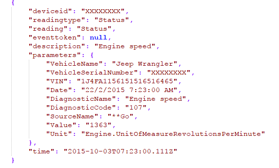

<!-- nav-top -->
[« صفحه‌ی اصلی](../../README.md) › [ابزارهای عمومی](../../README.md#utilities)

# خواندن مقدار از متن JSON در Dynamics CRM (استپ JSON Parser)

این استپ به شما اجازه می‌دهد یک مقدار را از داخل یک متن JSON بخوانید. متن JSON و مسیر (Path) مقدار موردنظر را می‌دهید و مقدار به‌صورت رشته (متن) برگردانده می‌شود.

برای استفاده از این استپ، در طراحی Workflow از منوی **Add Step** به گروه **MvcTeam Utilities** بروید و **JSON Parser** را انتخاب کنید:

سپس پارامترها را پر کنید: متن کامل JSON و مسیر مقداری که می‌خواهید بخوانید:

در نهایت می‌توانید مقدار خوانده‌شده را از نتیجه بردارید و در هر استپ بعدی استفاده کنید:

## شرح کامل پارامترها

* **JSON (اجباری)** : متن کامل JSON.
* **JSON Path (اجباری)** : مسیر مقداری که می‌خواهید بخوانید (شکل‌های مجاز مسیر در ادامه آمده است).
* **پارامتر خروجی: JSON Result** : مقدار پیدا‌شده، به‌صورت رشته.

## شکل‌های مجاز مسیر

| شکل مسیر | معنی | مثال |
|---|---|---|
| `a.b` | عضو `b` از داخل شیء `a` | `parameters.DiagnosticCode` |
| `a[0]` | عضو شماره‌ی `0` (شماره‌گذاری از صفر) از آرایه‌ی `a` | `list[1].Author` |
| `a['نام با فاصله']` | عضوی که نامش فاصله یا نویسه‌ی خاص دارد | `parameters['Vehicle Name']` |
| `$.a.b` | مانند `a.b`؛ نماد `$` در ابتدای مسیر اختیاری است | `$.parameters.VehicleName` |
| `$` | کل سند JSON (به‌صورت JSON فشرده) | `$` |

این شکل‌ها را می‌توانید با هم ترکیب کنید.

## قالب نتیجه

* رشته (string) بدون علامت نقل‌قول برمی‌گردد.
* عدد (number) همان‌طور که در JSON نوشته شده برمی‌گردد.
* `true` و `false` به‌صورت متن `true` و `false` برمی‌گردند.
* مقدار `null` به‌صورت رشته‌ی خالی برمی‌گردد.
* اگر مسیر پیدا نشود، نتیجه رشته‌ی خالی است.
* اگر مسیر به یک شیء یا آرایه برسد، همان بخش به‌صورت JSON فشرده (بدون فاصله و خط جدید) برمی‌گردد.
* اگر متن JSON معتبر نباشد، استپ با خطای `JSON is not valid` متوقف می‌شود.

> **توجه:** برخلاف نسخه‌ی اصلی که از کتابخانه‌ی Json.NET و متد `SelectToken` استفاده می‌کرد، این نسخه فقط شکل‌های مسیری را که در جدول بالا آمده پشتیبانی می‌کند (مثلاً فیلتر و `*` پشتیبانی نمی‌شود).

## مثال

یک نمونه‌ی JSON که Azure IoT برمی‌گرداند:

* مسیر `parameters.DiagnosticCode` مقدار `107` را برمی‌گرداند.
* مسیر `parameters.VehicleName` مقدار `Jeep Wrangler` را برمی‌گرداند.
* مسیر `eventtoken` (که در JSON برابر `null` است) رشته‌ی خالی برمی‌گرداند.

> **توجه:** تصاویر مربوط به رابط کاربری CRM از پروژه‌ی اصلی گرفته شده‌اند و رابط کاربری CRM در آن‌ها انگلیسی است.

---

منبع: این مستند ترجمه و بازنویسی مستند استپ JSONParser از پروژه‌ی متن‌باز [Dynamics-365-Workflow-Tools](https://github.com/demianrasko/Dynamics-365-Workflow-Tools) (نوشته‌ی Demian Rasko، مجوز Ms-PL) است.

---

<!-- nav-bottom -->
[⬆ بازگشت به فهرست اصلی و همه‌ی استپ‌ها](../../README.md#steps)

