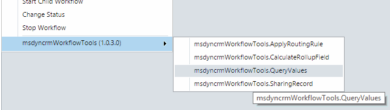
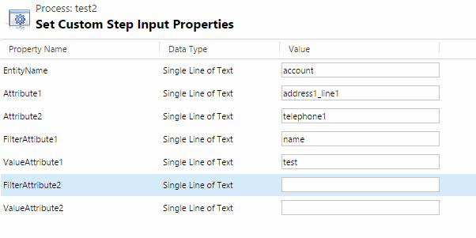
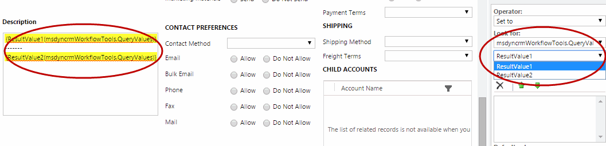

# Query Values (خواندن مقدار از یک موجودیت)

این استپ برای جستجو در یک موجودیت (entity) بسیار کاربردی است. با یک یا دو شرط روی فیلدها رکورد را پیدا می‌کنید و یک یا دو فیلد آن را می‌خوانید. برای گرفتن پارامترهایی که در موجودیت‌های دیگر (مثلاً یک موجودیت تنظیمات یا پارامترها) نگهداری می‌شوند، خیلی به کار می‌آید.

برای استفاده در Workflow این مراحل را انجام دهید. ابتدا از منوی **Add Step** به گروه **MvcTeam Utilities** بروید و استپ **Query Values** را انتخاب کنید:

سپس فیلدهای لازم را پر کنید:

## شرح کامل پارامترها

* **EntityName (اجباری)** : نام منطقی (logical name) موجودیتی که در آن جستجو می‌شود.
* **Attribute1 (اجباری)** : نام منطقی فیلد اول که باید خوانده شود.
* **Attribute2 (اختیاری)** : نام منطقی فیلد دوم که باید خوانده شود.
* **FilterAttribute1 (اجباری)** : نام منطقی فیلد اول شرط جستجو.
* **ValueAttribute1** : مقدار فیلد اول شرط جستجو. اگر خالی بماند، شرط یعنی «FilterAttribute1 خالی باشد».
* **FilterAttribute2 (اختیاری)** : نام منطقی فیلد دوم شرط جستجو.
* **ValueAttribute2** : مقدار فیلد دوم شرط جستجو. اگر FilterAttribute2 را پر کرده‌اید و این مقدار خالی باشد، شرط یعنی «FilterAttribute2 خالی باشد».

پارامترهای خروجی:

* **ResultValue1** : مقدار خوانده‌شده برای Attribute1.
* **ResultValue2** : مقدار خوانده‌شده برای Attribute2. اگر Attribute2 را پر نکرده باشید، خالی است.
* **Record Found** : اگر رکوردی پیدا شود `True` و در غیر این صورت `False` است.

سپس می‌توانید مقدارهای خوانده‌شده را در استپ‌های بعدی Workflow استفاده کنید:

## نحوه‌ی کار

* اگر دو شرط بدهید، رکوردی پیدا می‌شود که **هر دو** شرط را داشته باشد (شرط‌ها با «و» ترکیب می‌شوند و از نوع «برابر» هستند).
* اگر چند رکورد با شرط‌ها هم‌خوانی داشته باشد، فقط **اولین** رکورد استفاده می‌شود.
* اگر هیچ رکوردی پیدا نشود، هر دو ResultValue خالی هستند و Record Found برابر `False` است. استپ خطا نمی‌دهد.
* استپ با دسترسی کاربر اجراکننده‌ی Workflow اجرا می‌شود؛ پس فقط رکوردهایی را پیدا می‌کند که آن کاربر اجازه‌ی خواندنشان را دارد.

## قالب مقدارهای خروجی

مقدار همه‌ی فیلدها به‌صورت متن برمی‌گردد:

| نوع فیلد | مقدار خروجی |
|---|---|
| Lookup | GUID رکورد |
| Option Set | عدد گزینه |
| Money و عددهای اعشاری | عدد، با «.» به‌عنوان جداکننده‌ی اعشار |
| Two Options (دو گزینه‌ای) | `true` یا `false` |
| تاریخ | قالب ISO به وقت UTC، مثلاً `2026-09-24T08:30:00Z` |

> **توجه:** در نسخه‌ی اصلی از نسخه‌ی 1.0.36.0 به بعد پر کردن Attribute2 اجباری شده بود. در این پروژه Attribute2 اختیاری است.

> **توجه:** تصاویر بالا از پروژه‌ی اصلی گرفته شده‌اند و رابط کاربری CRM در آن‌ها انگلیسی است. در آن نسخه، خروجی Record Found وجود نداشت و نام پارامتر FilterAttribute1 با غلط املایی «FilterAttibute1» دیده می‌شود.

---

منبع: این مستند ترجمه و بازنویسی مستند استپ Query Values از پروژه‌ی متن‌باز [Dynamics-365-Workflow-Tools](https://github.com/demianrasko/Dynamics-365-Workflow-Tools) (نوشته‌ی Demian Rasko، مجوز Ms-PL) است.

