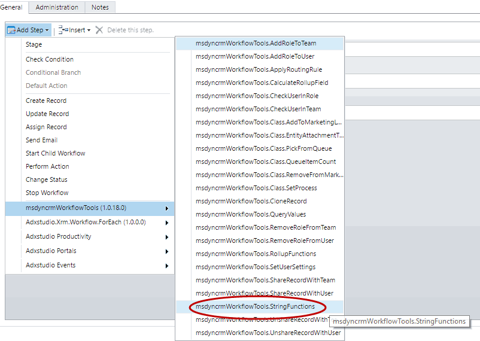
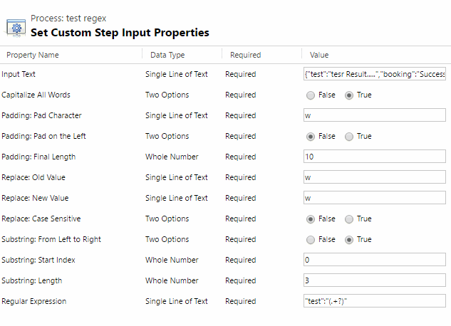
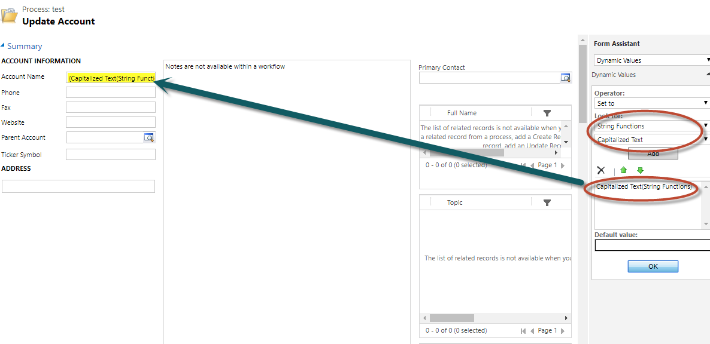

<!-- nav-top -->
[« صفحه‌ی اصلی](../../README.md) › [ابزارهای عمومی](../../README.md#utilities)

# توابع متنی در Dynamics CRM (استپ String Functions)

این استپ چند عملیات رایج روی متن را یک‌جا انجام می‌دهد: بزرگ‌کردن حرف اول کلمه‌ها، پُر کردن (Padding)، جایگزینی، جدا کردن بخشی از متن (Substring)، Regular Expression، حروف بزرگ و کوچک، حذف فاصله‌های اطراف و حذف همه‌ی فاصله‌ها.

برای استفاده از این استپ، در طراحی Workflow از منوی **Add Step** به گروه **MvcTeam Utilities** بروید و **String Functions** را انتخاب کنید:

سپس پارامترها را پر کنید:

هر بار که استپ اجرا می‌شود **همه‌ی عملیات** انجام می‌شود و همه‌ی خروجی‌ها مقدار می‌گیرند. شما فقط خروجی‌هایی را که لازم دارید در استپ‌های بعدی استفاده می‌کنید. پارامترهای مربوط به عملیاتی که لازم ندارید را می‌توانید با مقدار پیش‌فرض رها کنید.

## پارامترهای ورودی

**متن ورودی**

* **Input Text (اجباری)** : متنی که توابع روی آن اجرا می‌شوند.

**بزرگ‌کردن حرف اول**

* **Capitalize All Words (پیش‌فرض: True)** : اگر `True` باشد، حرف اول **هر کلمه** بزرگ می‌شود. اگر `False` باشد، فقط حرف اول **کل متن** بزرگ می‌شود.

**پُر کردن (Padding)**

* **Padding: Pad Character** : نویسه‌ای که برای پُر کردن استفاده می‌شود. اگر چند نویسه بدهید فقط اولین نویسه استفاده می‌شود؛ اگر خالی باشد، فاصله (space) استفاده می‌شود.
* **Padding: Pad on the Left (پیش‌فرض: False)** : اگر `True` باشد، از سمت چپ پُر می‌شود. اگر `False` باشد، از سمت راست.
* **Padding: Final Length (پیش‌فرض: 10)** : طول نهایی متن بعد از پُر کردن.

**جایگزینی (Replace)**

* **Replace: Old Value** : متنی که باید جایگزین شود.
* **Replace: New Value** : متن جدید.
* **Replace: Case Sensitive (پیش‌فرض: False)** : مشخص می‌کند در جایگزینی، بزرگی و کوچکی حروف مهم باشد یا نه. اگر `True` باشد، فقط متنی جایگزین می‌شود که دقیقاً با همان حروف بزرگ و کوچک باشد (`hello` با `Hello` یکی حساب نمی‌شود). اگر `False` باشد، بزرگی و کوچکی حروف نادیده گرفته می‌شود و هر سه مورد `hello` و `Hello` و `HELLO` جایگزین می‌شوند.

**جدا کردن بخشی از متن (Substring)**

* **Substring: From Left to Right (پیش‌فرض: True)** : اگر `True` باشد، Start Index از ابتدای متن شمرده می‌شود. اگر `False` باشد، از انتهای متن.
* **Substring: Start Index (پیش‌فرض: 0)** : اندیس نویسه‌ی شروع (شماره‌گذاری از صفر).
* **Substring: Length (پیش‌فرض: 3)** : تعداد نویسه‌هایی که جدا می‌شوند. اگر از انتهای متن بیشتر شود، تا انتهای متن جدا می‌شود.

**Regular Expression**

* **Regular Expression** : عبارت باقاعده‌ای که روی Input Text اجرا می‌شود. اگر خالی بماند، Regex اجرا نمی‌شود.

## پارامترهای خروجی

| خروجی | مقدار |
|---|---|
| **Capitalized Text** | متن پس از بزرگ‌کردن حرف اول (طبق Capitalize All Words) |
| **Text Length** | طول متن |
| **Padded Text** | متن پس از پُر کردن |
| **Replaced Text** | متن پس از جایگزینی. اگر Replace: Old Value خالی باشد، همان متن ورودی است. |
| **Substring Text** | بخش جداشده از متن. اگر Start Index یا Length معتبر نباشد، خالی است. |
| **Trimmed Text** | متن پس از حذف فاصله‌های ابتدا و انتها |
| **Regex Success** | اگر Regular Expression با متن هم‌خوانی داشته باشد `True` است |
| **Regex Text** | اولین بخشی از متن که با Regular Expression هم‌خوانی دارد. اگر هم‌خوانی نبود، خالی است. |
| **Uppercase Text** | متن با حروف بزرگ |
| **Lowercase Text** | متن با حروف کوچک |
| **Without Spaces** | متن پس از حذف همه‌ی فاصله‌ها |

استفاده از یکی از خروجی‌ها در استپ بعدی (مثلاً Capitalized Text برای نام حساب):

> **توجه:** تصاویر بالا از پروژه‌ی اصلی گرفته شده‌اند و رابط کاربری CRM در آن‌ها انگلیسی است.

---

منبع: این مستند ترجمه و بازنویسی مستند استپ String Functions از پروژه‌ی متن‌باز [Dynamics-365-Workflow-Tools](https://github.com/demianrasko/Dynamics-365-Workflow-Tools) (نوشته‌ی Demian Rasko، مجوز Ms-PL) است.

---

<!-- nav-bottom -->
[⬆ بازگشت به فهرست اصلی و همه‌ی استپ‌ها](../../README.md#steps)

